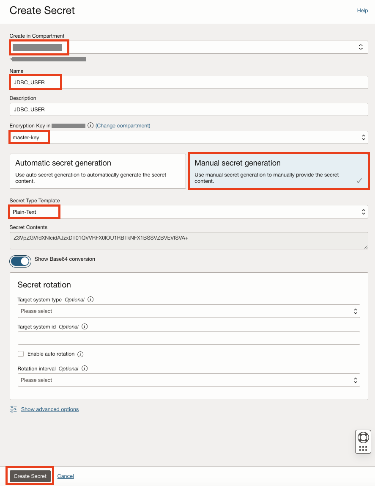
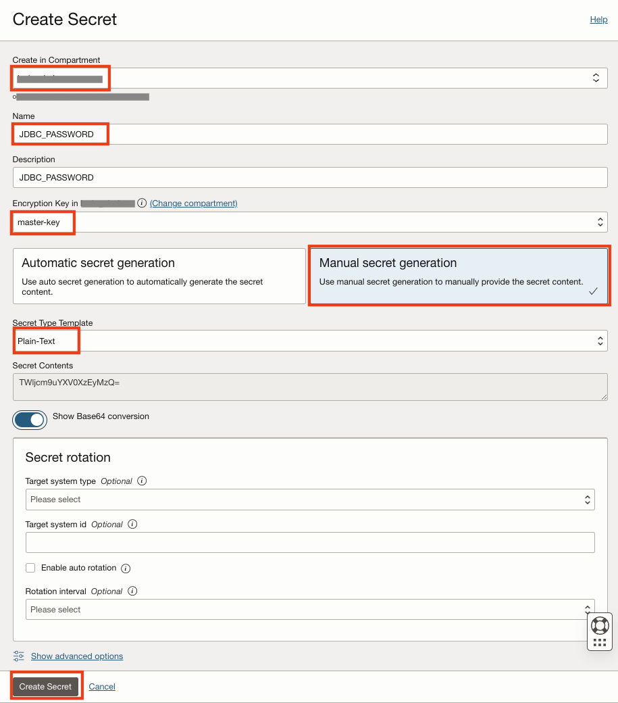

# Configure the MySQL HeatWave Database instance and the Vault

## Introduction

This lab provides instructions to configure the the OCI MySQL HeatWave Database instance and the OCI Vault.

Flyway will create the database tables the first time the application starts, but you must create a database user first.

Estimated Lab Time: 05 minutes

### Objectives

In this lab, you will:

* Set the MySQL Private IP Address value
* Create a MySQL database, a user and password
* Create secrets in the Vault for database user and password

## Task 1: Set the MySQL Private IP Address value

Set the MySQL Private IP Address value in an environment variable called `MYSQL_IP` for use in subsequent steps.

1. From the Oracle Cloud Console, navigate to **Databases >> HeatWave MySQL >> DB Systems >> DB System Details**. In the **Connections** tab, under **Primary endpoint**, click **Copy** to copy the **Private IP address**.

   

2. From the same terminal in VS Code, set the environment variable `MYSQL_IP` using the <Private-IP> you copied.

	```bash
	<copy>
	export MYSQL_IP='<Private-IP>'
	</copy>
	```

3. Confirm the value set by running the following command:

	```bash
	<copy>
	echo $MYSQL_IP
	</copy>
	```

4. Connect to the OCI MySQL HeatWave DB System instance using the private IP Address, the administrator username "mysqladmin" and the password you created earlier.

   >**Note**: If you entered a different administrator username when you created the OCI MySQL DB System instance, replace "mysqladmin" before running the following command:

	```bash
	<copy>
	mysql --host $MYSQL_IP -u mysqladmin -p
	</copy>
	```

   When prompted to enter a password, enter the password you used when you created the OCI MySQL DB System instance.

   You should see the `mysql>` prompt.

## Task 2: Create a MySQL database, a user and password

1. From the the `mysql>` prompt, create the database (use any valid database name, for example, “gdkDB”):

	```bash
	<copy>
	CREATE DATABASE gdkDB;
	</copy>
	```

2. Navigate to the **Compute >> Instances** section in the Oracle Cloud Console, find your compute instances in the list, open it, in the **Instance Details** section find **Primary VNIC**, copy the value of the **Private IPv4 address**.

   

3. Create a database user. Use any valid MySQL username, for example, “guide_user”, and a valid password:

	```bash
	<copy>
	CREATE USER 'guide_user'@'<compute_instance_private_ip>' IDENTIFIED BY '<password>';
	</copy>
	```

	Replace the text `<compute_instance_private_ip>` with the value you copied.
	The `<password>` must be at least eight characters long, with at least one numeric character, one lowercase character, one uppercase character, and one non-alphanumeric character.

4. Grant access to the database for the new user:

	```bash
	<copy>
	GRANT ALL ON gdkDB.* TO 'guide_user'@'<COMPUTE_INSTANCE_PRIVATE_IP>';
	</copy>
	```

5. Exit the MySQL console:

	```bash
	<copy>
	exit
	</copy>
	```

## Task 3: Create secrets in the Vault for the database user and password

1. In the **Vault** you created, navigate to **Secrets**, click **Create Secret**.

2. Created two secrets - `JDBC_USER` and `JDBC_PASSWORD` - in the your workshop compartment.

3. Enter the following details:

      ```
      Name: JDBC_USER

      Encryption Key: master-key (Select the master key created in the previous lab)

      Manual secret generation

      Secret Type Template: Plain-Text

      Secret Contents: guide_user

      Show Base64 conversion: YES
      ```

      

4. Enter the following details:

      ```
      Name: JDBC_PASSWORD

      Encryption Key: master-key (Select the master key created in the previous lab)

      Manual secret generation

      Secret Type Template: Plain-Text

      Secret Contents: (Paste the secret value created in the above task)

      Show Base64 conversion: YES
      ```

      

Congratulations! In this section, you created a database, a user and password, and the secrets in OCI Vault.

You may now **proceed to the next lab**.

## Acknowledgements

* **Author** - [](var:author)
* **Contributors** - [](var:contributors)
* **Last Updated By/Date** - [](var:last_updated)
